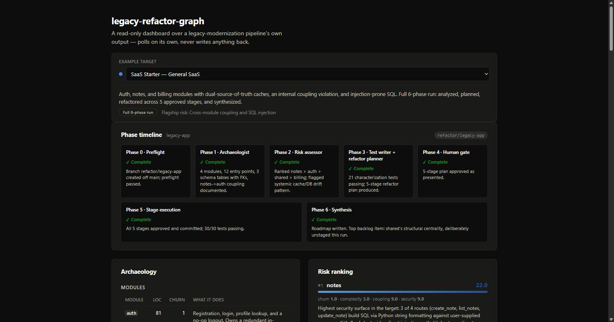
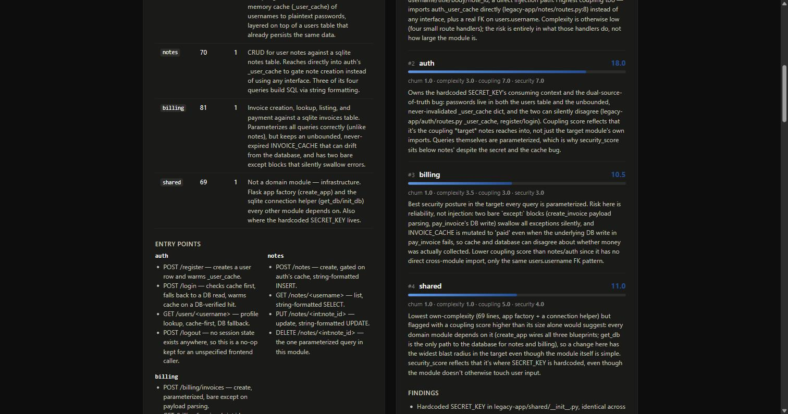
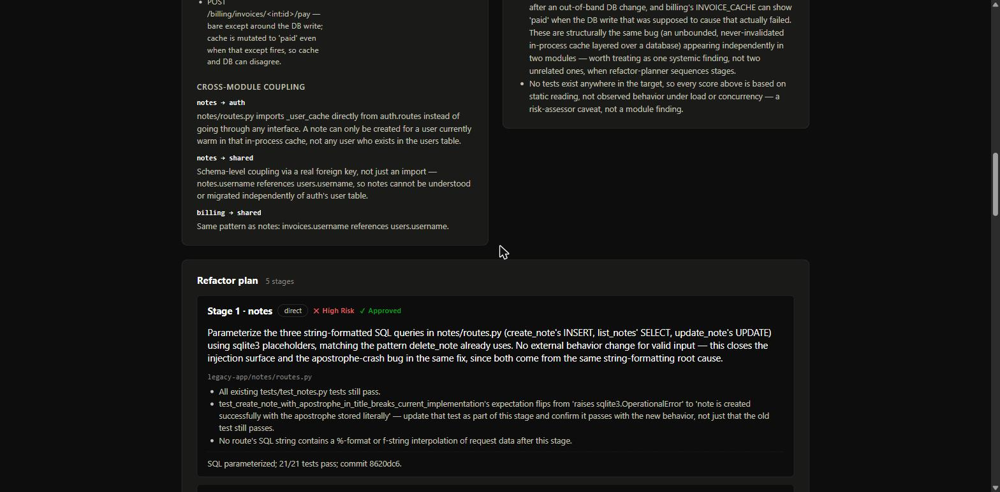
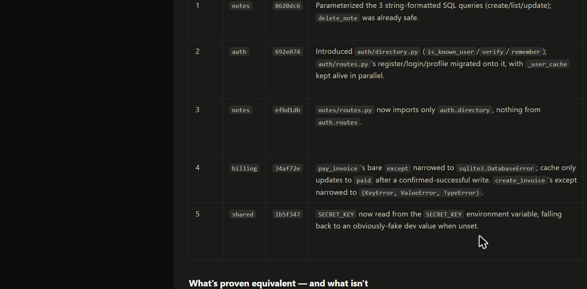
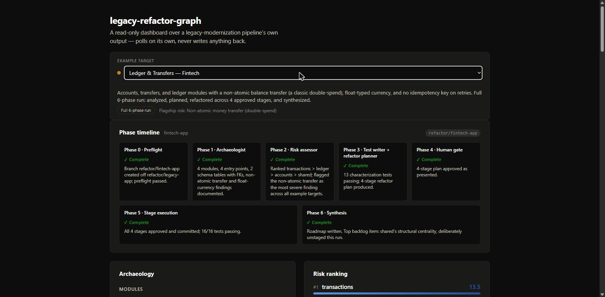
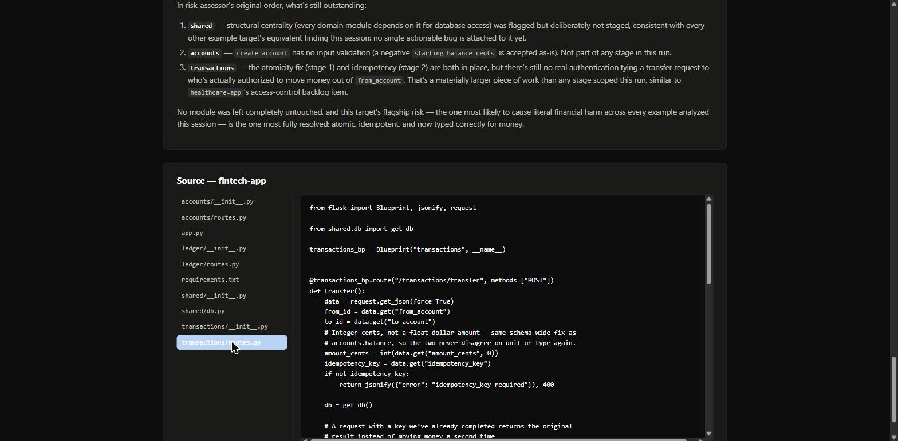
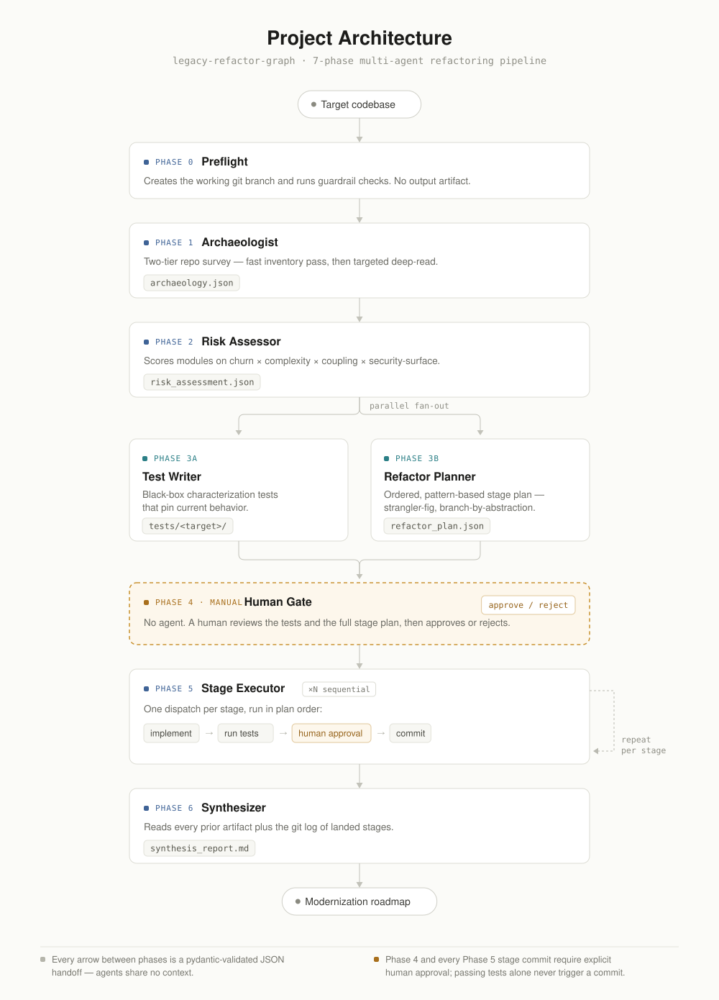

# legacy-refactor-graph

**A 6-phase multi-agent pipeline that surveys, risk-ranks, characterization-tests, and
incrementally modernizes legacy codebases — with a human approval gate on every single commit.**

[](https://github.com/AnikNicks/legacy-refactor-graph/actions/workflows/ci.yml)
[](https://github.com/AnikNicks/legacy-refactor-graph/actions/workflows/deploy-pages.yml)
[](https://anicknicks.github.io/legacy-refactor-graph/)
[](LICENSE)

**[Live dashboard →](https://anicknicks.github.io/legacy-refactor-graph/)** — no install needed, browse all four completed runs and their source.



---

## What this is

Legacy modernization tools either rewrite blindly or stop at "here's a list of problems." This
pipeline does neither: it's an orchestrator plus six specialist agents, coordinated through
**file-based handoffs** (not shared context) and **pydantic-validated contracts** at every
boundary, that takes a legacy codebase from *unexamined* to *risk-ranked, characterization-tested,
and incrementally refactored* — while refusing to auto-commit a single line without an explicit
human approval, even when every test is green.

It's demonstrated end-to-end against four fixture apps spanning different domains (general SaaS,
e-commerce, healthcare, fintech), each carried through all six phases: real bugs found, real
tests written, real commits made, real modernization roadmap produced.

## Core features

- **Phase DAG, not a script.** Preflight → Archaeologist → Risk-assessor → (Test-writer ∥
  Refactor-planner) → Human gate → Stage execution → Synthesis. Independent phases fan out in
  parallel; dependent phases don't run until their inputs are validated.
- **Two-tier codebase survey.** A fast, repo-wide inventory pass (module map, LOC, git churn,
  entry points) followed by targeted deep-reads only where risk signals point — the same agent
  design scales from a 400-line fixture to a real monorepo without blowing its context budget.
- **Risk-ranked, not flat.** Every module is scored on churn × complexity × coupling ×
  security-surface, and that ranking is what sequences the refactor stages.
- **Incremental-modernization patterns, not rewrites.** Stages use strangler-fig,
  branch-by-abstraction, and contract tests proving old/new equivalence before cutover.
- **Black-box characterization tests first.** Request/response-level tests against real routes,
  written and passing *before* any refactor stage touches the code they protect.
- **A human checkpoint on every stage commit.** Passing tests are necessary, never sufficient —
  the orchestrator stops and presents the diff for explicit approval before anything lands.
- **Schema-validated handoffs.** Every phase's JSON output is pydantic-validated against
  `scripts/schemas.py` before the next phase is allowed to start; a failure gets one guarded retry,
  then the run stops.

## Live demo

The dashboard is a read-only viewer over the pipeline's own output — it polls `output/*.json`,
never writes anything back. Four fixture apps, each carried through all six phases:

| Example | Category | Flagship risk | Stages |
|---|---|---|---|
| SaaS Starter | General SaaS | Cross-module coupling + SQL injection | 5 |
| Storefront | E-Commerce | Non-atomic inventory decrement (overselling) | 4 |
| Patient Records | Healthcare | PII/PHI exposure, no audit trail | 5 |
| Ledger & Transfers | Fintech | Non-atomic money transfer (double-spend) | 4 |

Switch between them with the dropdown at the top of the [live dashboard](https://anicknicks.github.io/legacy-refactor-graph/), or run it locally (see [Getting started](#getting-started)).

<table>
<tr>
<td></td>
<td></td>
</tr>
<tr>
<td></td>
<td></td>
</tr>
</table>

Every example ships its full source in-browser — the **Source** panel below each run shows the
actual (post-refactor) implementation, e.g. the fintech app's fixed atomic, idempotent transfer:



## Project Architecture



| Agent | Tools | Reads | Writes |
|---|---|---|---|
| `archaeologist` | Read, Grep, Glob, Write, SQLite MCP (RO) | target source | `archaeology.json` |
| `risk-assessor` | Read, Grep, Write, SQLite MCP (RO) | `archaeology.json` | `risk_assessment.json` |
| `test-writer` | Read, Write, Bash | `archaeology.json`, `risk_assessment.json` | `tests/<target>/` |
| `refactor-planner` | Read, Write | `archaeology.json`, `risk_assessment.json` | `refactor_plan.json` |
| `stage-executor` | Read, Edit, Write, Bash | one `Stage` from the plan | code diff, `stage_N_result.json` |
| `synthesizer` | Read, Bash (`git log`), Write | every prior `output/*.json` | `synthesis_report.md` |

`test-writer` and `refactor-planner` run **in parallel** — neither reads the other's output, which
is what makes concurrent dispatch correct instead of accidental. Full node-by-node contracts live
in [`GRAPH.md`](GRAPH.md); the orchestrator that walks this DAG step-by-step is
[`.claude/commands/refactor-legacy-app.md`](.claude/commands/refactor-legacy-app.md).

## Guardrails

Stated honestly — see [`SECURITY.md`](SECURITY.md) for the full breakdown of enforced vs.
convention-level.

**Enforced by `scripts/validate_state.py`:**
- Every phase's JSON output is pydantic-validated before the next phase can start.
- Phase 5's git diff is checked to touch only `<target>/` and `tests/` — never outside the target.
- Preflight refuses to run if the current branch is `main`.
- No Phase-5 commit runs without an explicit human approval, regardless of test results.

**Convention-level (agent-prompt discipline, not sandboxed):** least-privilege tool grants
(`archaeologist`/`risk-assessor` get no `Edit` or write-capable `Bash`), context-budget discipline
in the tier-1 survey pass, read-only SQLite MCP usage, and no secret ever echoed into a commit
message or external call.

## Engineering notes

Real issues found and fixed *during* this pipeline's own runs, not staged for the demo:

- **Transactional-safety bug, `ecommerce-app` stage 2.** `inventory.service.decrement_stock`
  originally opened and committed its own DB connection — which would have broken
  `cart.checkout`'s all-or-nothing transaction (an earlier item's decrement wouldn't roll back if a
  later item failed). Found while implementing the stage, fixed by adding an optional `conn`
  parameter so the caller's transaction is reused, proven by
  `test_checkout_rolls_back_earlier_items_when_a_later_item_fails`.
- **Stale-data bug in the viewer itself.** Switching the example dropdown could leave the previous
  target's data on screen if the new target's file 404'd (e.g. no `refactor_plan.json` yet) — a
  failed fetch wasn't clearing state. Fixed in [`useJson.ts`](viewer/src/lib/useJson.ts) /
  [`useText.ts`](viewer/src/lib/useText.ts) with a `useEffect` that resets state synchronously on
  path change, before the async fetch resolves.
- **Test isolation across four fixture apps.** Every target has a module literally named `shared`
  — running all suites in one pytest process caused `sys.modules` collisions. Fixed by scoping each
  target to its own `tests/<target>/` directory with an independent `conftest.py`, and documenting
  the convention directly in `test-writer.md` so it doesn't regress.

## Tech stack

| Layer | Choice |
|---|---|
| Agents & orchestration | Claude Code subagents (`.claude/agents/*.md`) + a command-file orchestrator (`.claude/commands/refactor-legacy-app.md`) |
| Handoff contracts | Pydantic models (`scripts/schemas.py`) validated by a CLI guardrail (`scripts/validate_state.py`) |
| Fixture apps under test | Python 3.12, Flask 3.0 |
| Characterization tests | pytest, Flask `test_client()` |
| Dashboard | React 18 + TypeScript + Vite 5 |
| Markdown rendering | `marked` |
| CI | GitHub Actions — pytest + schema validation, viewer typecheck + build |
| Hosting | GitHub Pages (`actions/deploy-pages`) |
| MCP | SQLite MCP (read-only), wired to `archaeologist` / `risk-assessor` |

## Repository structure

```
.claude/
  agents/                 six subagent definitions (archaeologist, risk-assessor, ...)
  commands/refactor-legacy-app.md   the orchestrator
scripts/
  schemas.py               pydantic contracts for every phase handoff
  validate_state.py        preflight / validate / stage-diff-check CLI
legacy-app/ ecommerce-app/ healthcare-app/ fintech-app/
                            the four example targets, post-refactor
tests/<target>/             black-box characterization tests, one suite per target
output/<target>/            every phase's JSON/markdown artifact — the audit trail
viewer/                     React/TS/Vite read-only dashboard over output/
GRAPH.md                    architecture spec — the DAG and every node's contract
SECURITY.md                 guardrails, stated honestly
PROGRESS.md                 human-readable run state for all four targets
```

## Getting started

**Run the pipeline against a target:**
```bash
pip install flask pydantic pytest
python scripts/validate_state.py preflight --target legacy-app
# then: /refactor-legacy-app legacy-app   (inside Claude Code)
```

**Run the dashboard locally:**
```bash
cd viewer
npm install
npm run dev      # live-reads output/*.json and target source via dev middleware
```

**Run the test suites:**
```bash
for target in legacy-app ecommerce-app healthcare-app fintech-app; do
  python -m pytest "tests/$target/" -q
done
# 86/86 passing across all four targets (30 + 20 + 20 + 16)
```

## Roadmap

- Wire in the MCP extensions already documented but not live in `CLAUDE.md` (Git MCP for real
  churn stats, code-intelligence MCP for real import graphs, CVE-scanning MCP for real
  security-surface findings).
- Point the pipeline at a real open-source legacy codebase, not just fixture apps.
- Land Phase 5 stages as PRs (via GitHub MCP) instead of direct commits, so the human checkpoint
  doubles as code review.

## License

[MIT](LICENSE)
